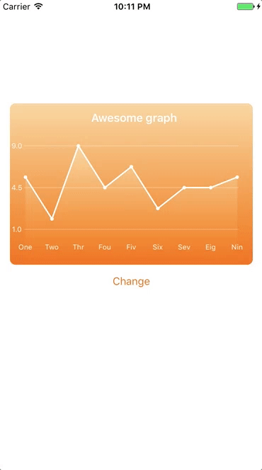

# AnimatedGraph

Animated Graph which you can include in your application to show information
in more attractive way

1. You need to download and import _folder_ **Graph** to your project
2. Add **View** to **ViewController** and choose _classname_ **GraphView**
3. Choose **IBDesignable** colors in **Interface Builder**
4. Make **IBOutlet** of **GraphView**
5. Configure GraphView with method

```swift
/// At first you need to configure graph with launch data.
///
/// - Parameters:
///   - points: Launch array of points
///   - columnNames: Bottom located column names.
///   - title: Title of graph
func configure(withPoints points: [Double], columnNames: [String]?, title: String?)


/// Animate Graph to min values
func animateToMinValues()

/// Use this method to animate graph with other points and column names.
/// - Parameters:
///   - points: Array of points
///   - columnNames: Array of column names
func animate(withPoints points: [Double], columnNames: [String]?)
```

6. To animate use method

```swift
/// Use this method to animate graph with other points and column names.
/// - Parameters:
///   - points: Array of points
///   - columnNames: Array of column names
func animate(withPoints points: [Double], columnNames: [String]?)
```

If you have problems, just look at the example of usage in _ViewController.swift_

